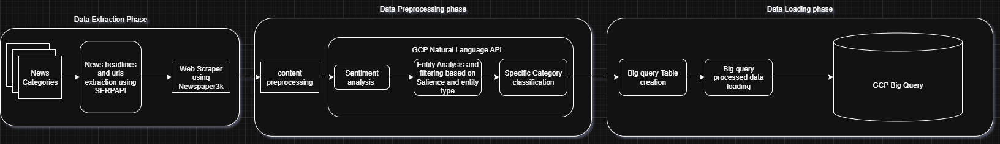
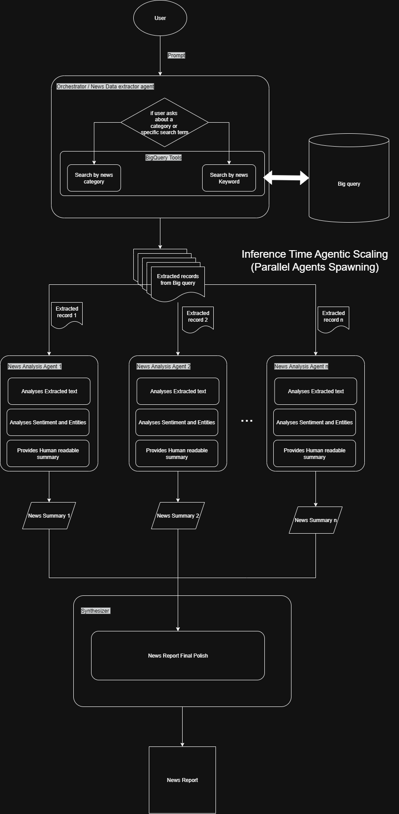

# Real Time News Summarizer Agent

**Short description**: This repository implements a pipeline and an *inference-time agentic* workflow that extracts recent news via SerpApi, scrapes article content, preprocesses it using Google Cloud NLP (entities, sentiment, classification), stores the cleaned dataset in BigQuery, and runs an orchestrator→worker→synthesizer agent graph (built with `langgraph` + `langchain-google-genai`) to produce concise, structured news summaries.

---

## Project tree (top-level)

```
gcp task/
├─ .env.example              # example environment variables
├─ creds_example.json        # Example GCP creds
├─ ETL.py                    # helper script to run full extraction → preprocess → upload to GCP BigQuery
├─ notebook.ipynb            # demo notebook (quickstart / manual runs + graph invoke)
├─ requirements.txt          # install dependencies
├─ data/                     # expected runtime CSV output files (created by scripts)
│  ├─ raw_news.csv           # The extracted headlines and articled urls
│  ├─ preprocessed_news.csv  # The scraped url contents preprocessed , sentiment and entity analysis  
│  └─ news.csv               # The final merged preprocessed csv 
├─ data_extractor/
│  ├─ extractor.py           # SerpApi-based news collection
│  └─ __init__.py
├─ preprocessor/
│  ├─ preprocess_data.py     # scraping, content extraction, GCP NLP (entities, sentiment, classification)
│  ├─ data_merger.py         # merge raw + preprocessed and filter bad records
│  ├─ data_insert.py         # BigQuery dataset/table creation + load from CSV
│  └─ __init__.py
├─ agents/
│  ├─ graph.py               # StateGraph definition (orchestrator → worker → synthesizer)
│  ├─ nodes.py               # node (agent) implementations: decision_agent, news_summarizer, assign_workers, synthesizer
│  ├─ states.py              # Graph state types (Orchestrator and worker states)
│  ├─ tools.py               # Bq_tools: helper methods to query BigQuery
│  └─ llm_chains/            # LLM prompt templates, LLM wrappers, and structured output models
│     ├─ llm.py              # ChatGoogleGenerativeAI LLM instances (gemini models)
│     ├─ chains.py           # composed chains (decision_chain, news_summarizer_chain)
│     ├─ structred_outputs.py# pydantic models for structured output
│     └─ prompts/            # Prompts Folder 
│        ├─ decision_llm.txt
│        └─ news_summarizer.txt
└─ Project end
```

> Note: the `data/` folder is generated at runtime by the ETL and preprocessing scripts.

---

## High-level architecture & concepts

### 1) ETL (one-time / periodic load)




* `data_extractor/extractor.py` calls **SerpApi** (Google News tab via `https://serpapi.com/search`) using the `SERPAPI_api_key` environment variable to collect recent headlines/URLs across category queries (AI, business, politics, tech, etc.).

* It writes `./data/raw_news.csv` with `category, headline, url` rows.

* `preprocessor/preprocess_data.py` then reads `raw_news.csv` and for each URL:

  * Uses `newspaper3k.Article` to download and extract main article text.
  * Calls Google Cloud NLP (`google.cloud.language_v1.LanguageServiceClient`) to:

    * perform sentiment analysis,
    * extract entities (returned with salience scores), and
    * classify the text into categories (with confidences).
  * The module ranks and selects main entities (filters by type and salience) and picks the top classification category (highest confidence)
  * The preprocessor runs requests in parallel (`concurrent.futures.ThreadPoolExecutor`) and writes `./data/preprocessed_news.csv`.

* `preprocessor/data_merger.py` merges `raw_news.csv` + `preprocessed_news.csv`, filters out failures or low-quality scrapes, and writes `./data/news.csv` (final dataset used by agents and BigQuery ingestion).

* `preprocessor/data_insert.py` contains helpers to create a BigQuery dataset/table and upload `./data/news.csv` into BigQuery. It expects `PROJECT_ID` env var and a `GOOGLE_APPLICATION_CREDENTIALS` pointing to a GCP JSON service account key (or that `creds.json` is set appropriately).

**`ETL.py`** orchestrates the one-shot flow:

```py
from data_extractor import collect_news
from preprocessor import extract_and_preprocess, combine_data, create_table_from_csv_direct

# Run in sequence to extract -> preprocess -> combine -> upload
extract_data_upload_bq()
```

> The repository's `ETL.py` is intended as a one-time or periodically-run loader (cron / Cloud Function / Airflow job). It is not a streaming collector; SerpApi query options (e.g. `tbs`) are currently set to past week.

### 2) Inference-time agentic scaling: orchestrator → worker → synthesizer

This project uses an **orchestrator-worker-synthesizer** graph implemented with `langgraph`.

* **Orchestrator (decision\_agent)**: reads a user prompt (via the notebook or graph invocation), uses `decision_chain` to decide *search strategy* — either `by_category` or `by_search_term` — and returns a plan (a list of `planned_sections`). Each planned section corresponds to a query slice (e.g., "AI headlines summary", or "articles about Google AI acquisition").

* **Assign workers**: the orchestrator's output is turned into multiple worker tasks. The graph uses `workflow.add_conditional_edges("orchestrator", assign_workers, ['worker'])` so the orchestrator can spawn N worker tasks.

* **Worker (news\_summarizer)**: for each assigned section the worker runs `news_summarizer_chain` (a system prompt + Gemini model with structured output) that produces a `heading` and `summary`. The worker returns the summary as an `AIMessage` and marks the section completed.

* **Synthesizer**: gathers all completed sections and concatenates them into a final report which is returned to the user.

This design allows *parallelism at inference time*: the orchestrator defines multiple independent summarization sub-tasks, then worker nodes process them concurrently (in practice you should spawn them in parallel using threads/processes or run multiple graph invocations) to scale summarization across many sections or categories.

**Why this is called "agentic scaling"**

* Instead of a single monolithic LLM prompt answering the whole query, the system decomposes the task (planning) and dispatches multiple focused agents (workers) to run specialized LLM chains in parallel, then consolidates outputs. This reduces latency for large jobs and improves modularity.

---

## Module-level details

### `notebook.ipynb`
---

### What Can You Do in the Notebook?

- **👀 Instantly fetch and explore trending news** from SerpApi, categorized by topic.
- **🧠 Scrape, preprocess, and enrich content** with Google Cloud NLP—analyze sentiment, extract key entities, and auto-classify topics.
- **🔎 Clean and merge your dataset**—filter out low-quality/incomplete articles.
- **⚡️ Launch the agentic summarizer** (orchestrator → worker(s) → synthesizer) on *your* query for fast, structured news digests.
- **📊 Inspect results live**—DataFrames, summaries, debugging info, and more!
- **☁️ [Optional] Upload directly to BigQuery** for scalable analytics.

---

### Sample Step-by-Step Workflow

* Quickstart demo. Key steps:

  1. `load_dotenv()` to load env variables
  2. `collect_news()` — generates `data/raw_news.csv`
  3. Run preprocessor steps and combine data (manually or via `ETL.py`)
  4. Build the `workflow` from `agents/graph.py` and call `graph.invoke({"messages": [HumanMessage(content=...)]})` to run the agentic graph.


---

💡 **Tip:**  
The notebook is the fastest way to see how your agentic pipeline decomposes, processes, and summarizes the news flow—all with real outputs at each step. *Try customizing the query and see the orchestration in action!*

---

👉 **Ready?** Open `notebook.ipynb` and watch your agentic news summarizer come alive!
---

### `data_extractor/extractor.py`

* Contains `category_queries` mapping categories to boolean search strings.
* Function `fetch_news_from_search(query, num_results=10)` calls SerpApi endpoint `https://serpapi.com/search` using `engine=google`, `tbm=nws` (news tab), `q` and `SERPAPI_api_key` from env.
* `collect_news()` iterates categories, fetches news\_results, collects `title` and `link`, and writes `./data/raw_news.csv`.
* **Notes**:

  * You must set `SERPAPI_api_key` in `.env`.
  * Respect SerpApi rate limits and costs; queries use `num=100` in the params then limit results locally.

### `preprocessor/preprocess_data.py`

* `GCPContentPreprocessor` class:

  * Uses `LanguageServiceClient()` for sentiment, entities, and classification.
  * `process_webpage(url)` extracts article text (`newspaper3k`), ensures minimum length, then calls `analyze_text_content`.
  * `analyze_text_content(text)` sorts entities by salience and picks top main entity types; picks the top classification by confidence and formats string outputs.
  * A `parallel_apply(...)` helper runs webpage processing across many URLs using a `ThreadPoolExecutor(max_workers=15)`.
  * Output is saved to `./data/preprocessed_news.csv`.

**Important caveats**: Google Cloud NLP classification (`classify_text`) has requirements (minimum text length) and may error for short content; the preprocessor includes error handling and fallback messages.

### `preprocessor/data_merger.py`

* Reads `raw_news.csv` + `preprocessed_news.csv`.
* Filters out rows where `extracted_text`, `sentiment`, or `entities` contain error markers (`Failed to fetch page`, `ERROR`, etc.).
* Writes cleaned `./data/news.csv` which contains merged fields and is the source for BigQuery uploads and agent queries.

### `preprocessor/data_insert.py`

* Provides helpers to create dataset/table and upload a DataFrame/CSV to BigQuery.
* Expects `PROJECT_ID` env var and Google Cloud credentials available to the environment (via `GOOGLE_APPLICATION_CREDENTIALS` or ADC).

### `agents/llm_chains/*`

* `llm.py` — instantiates LLM clients using `ChatGoogleGenerativeAI` (Gemini family). There are two LLM instances: `precise_llm` with `temperature=0.0` for deterministic decision-making, and `llm` for general summarization.
* `prompts/` — contains system prompt templates for the decision LLM (`decision_llm.txt`) and the news summarizer (`news_summarizer.txt`). These are wrapped into `ChatPromptTemplate`s in `prompts.py`.
* `structred_outputs.py` — contains pydantic models for the structured outputs:

  * `decision`: fields like `search_type` (Literal `'by_category'|'by_search_term'`) and `query_term`.
  * `news_summarizer`: fields `heading` and `summary`.
* `chains.py` composes prompt templates with LLMs and `.with_structured_output(...)` to guarantee typed outputs.

### `agents/tools.py` (`Bq_tools`)

* Lightweight wrapper around BigQuery client to run SQL queries against the loaded `news_data` table (dataset `news`).
* Example helper methods: `get_news_by_category(category)` and `get_news_by_search_term(search_term)` which use `CONTAINS_SUBSTR` on `category`/`entities` and return a DataFrame.

### `agents/graph.py` & `agents/nodes.py` & `agents/states.py`

* `graph.py` registers nodes with a `StateGraph(State)` and wires edges:

  * START → orchestrator
  * orchestrator → worker (conditional, using `assign_workers`)
  * worker → synthesizer
  * synthesizer → END
* `nodes.py` implements core node functions (ensure last message is a `HumanMessage` for Google Gen AI, calls to `decision_chain` and `news_summarizer_chain`) and data marshalling to/from `langgraph` messages.
* `states.py` defines the TypedDict/pydantic types representing graph state (messages, planned\_sections, completed\_sections).

---

## Running the code (quickstart)

1. **Install dependencies**

```bash
python -m venv venv
source venv/bin/activate   # or venv\Scripts\activate on Windows
pip install -r requirements.txt
```

2. **Environment variables & credentials**

Create a `.env` with at least:

```
SERPAPI_api_key=your_serpapi_key_here
PROJECT_ID=your_gcp_project_id
# Optional: path to credentials JSON if you don't use ADC
GOOGLE_APPLICATION_CREDENTIALS=/abs/path/to/creds.json
```

Make sure your service account has:

* `bigquery.datasets.create`, `bigquery.tables.create`, `bigquery.tables.updateData` for loading data.
* Access to Cloud Natural Language API and quotas enabled.

3. **One-shot ETL**

```bash
python ETL.py
# or, open notebook.ipynb and run the cells interactively
```

4. **Run the agentic workflow (notebook)**

* Open `notebook.ipynb` and run the cells. Example call in the notebook:

```py
from langchain_core.messages import HumanMessage
result = graph.invoke({"messages": [HumanMessage(content="tell me about the latest ai news")]})
print(result)
```

---

## Implementation notes, limitations & recommended improvements

1. **Missing/placeholder code**: `agents/nodes.py` contains `...` placeholders in places indicating some functions may be partially stubbed. Run-time may raise `ValueError` or TypeErrors if the final messages are not properly formatted. Review `ensure_last_message_is_user` and the decision agent implementation to ensure correct message/chain invocation.

2. **Rate limits & costs**: SerpApi and Google Cloud GenAI / NLP APIs are billable and rate-limited. Add exponential backoff, batching, and cache results to reduce costs.

3. **Parallelism**: `preprocessor` uses `ThreadPoolExecutor` (I/O-bound). For CPU-heavy NLP or heavy extraction you might move to `ProcessPoolExecutor` or run workers in a distributed environment (Cloud Run / Kubernetes). For agent workers: `langgraph` calls are likely synchronous — to truly parallelize worker LLM calls, launch separate async tasks or use worker pools.

4. **Productionization**:

* Add CI tests, unit tests for ETL and preprocessor.
* Add a Dockerfile and deployment scripts for reproducibility.
* Use a secret manager for API keys (Secret Manager / Hashicorp Vault) rather than committing `creds.json`.

5. **Data quality**: Add deduplication, robust HTML cleaning, and retry logic for `newspaper3k` failures. Consider using an HTML-to-text sanitizer instead of raw `newspaper3k` content when the article fails to parse.

6. **RAG / Retrieval**: If you plan on answering deeper questions, build an embeddings index (e.g., Pinecone / Chroma) and a RAG retrieval step so the summarizer can cite article snippets.

---

## Files to inspect first (suggested dev workflow)

1. `data_extractor/extractor.py` — verify SerpApi `params` and query templates.
2. `preprocessor/preprocess_data.py` — verify GCP NLP client usage, parallelism and error handling.
3. `agents/llm_chains/*` — adapt prompts and models to your available GenAI quota.
4. `agents/nodes.py` — finish any placeholder code and validate message types.
5. `preprocessor/data_insert.py` — ensure BigQuery schema fits your downstream needs.

---

## Quick troubleshooting

* **API authentication errors**: ensure `GOOGLE_APPLICATION_CREDENTIALS` is set and `SERPAPI_api_key` is valid.
* **GCP NLP errors on `classify_text`**: that endpoint requires enough text length. Skip classification for short articles or use a fallback.
* **Notebook errors when invoking graph**: verify `langgraph`/`langchain` versions, and that `HumanMessage`/`AIMessage` imports match the installed library versions (libraries often change message class locations).

---

